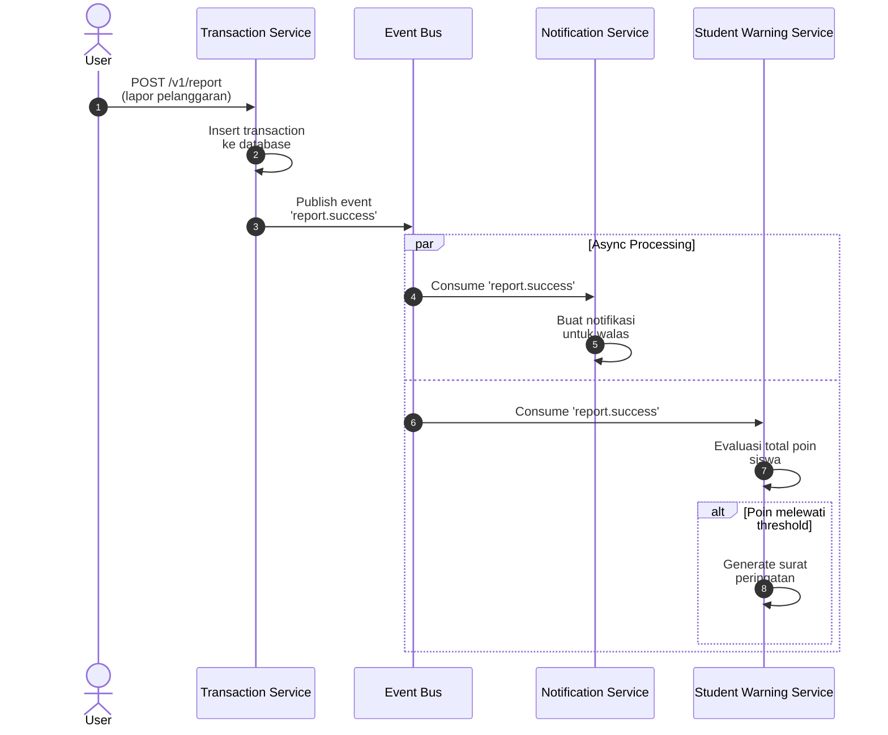
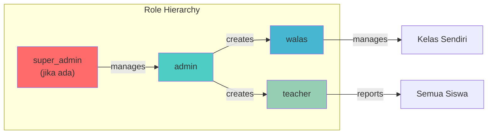
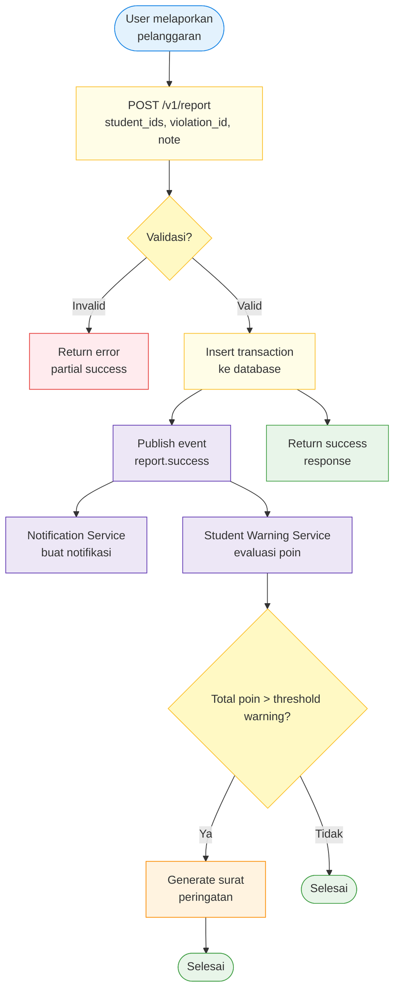
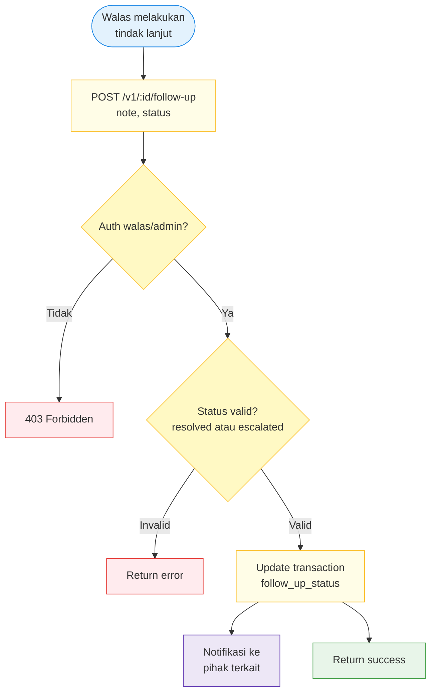
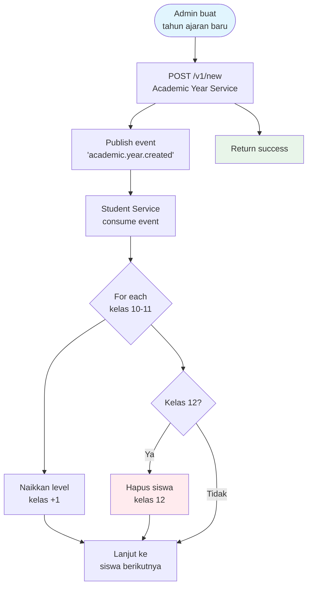
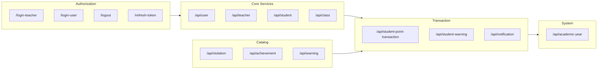

# Student Point Management System

Sistem manajemen poin pelanggaran dan prestasi siswa untuk sekolah. Mengelola data siswa, guru, kelas, pelanggaran, prestasi, serta peringatan otomatis berbasis poin.

## Fitur Utama

- **Manajemen Pengguna** — Autentikasi multi-role (admin, walas, teacher) dengan JWT
- **Manajemen Siswa & Guru** — CRUD siswa/guru dengan bulk insert via Excel
- **Manajemen Kelas** — Pemetaan kelas dengan wali kelas (walas)
- **Manajemen Pelanggaran & Prestasi** — Katalog poin pelanggaran dan prestasi
- **Transaksi Poin** — Pelaporan pelanggaran dan pemberian prestasi otomatis
- **Tindak Lanjut** — Follow-up pelanggaran oleh walas (resolved/escalated)
- **Sistem Peringatan** — Warning letter otomatis berdasarkan akumulasi poin
- **Notifikasi Real-time** — Event-driven notification via pub/sub
- **Statistik & Rekap** — Dashboard statistik dan export Excel
- **Tahun Ajaran** — Manajemen tahun ajaran aktif dengan auto-promote kelas

## Tech Stack

- **Backend:** [Golang] — REST API + Event-driven (Pub/Sub)
- **Authentication:** JWT (Access Token + Refresh Token)
- **Database:** MySQL / [sipresi]
- **Message Broker:** [Redis] — untuk event-driven services
- **Export:** Excel report generation

## Event-Driven Flow



### Daftar Event

| Event                   | Publisher                 | Subscriber                    | Deskripsi                             |
| ----------------------- | ------------------------- | ----------------------------- | ------------------------------------- |
| `report.success`        | student-point-transaction | notification, student-warning | Trigger notifikasi & surat peringatan |
| `academic.year.created` | academic-year             | student                       | Auto-naik kelas & hapus kelas 12      |

## Role & Authorization



| Role      | Deskripsi            | Akses                                |
| --------- | -------------------- | ------------------------------------ |
| `admin`   | Administrator sistem | Full access                          |
| `walas`   | Wali kelas           | Kelas sendiri, follow-up pelanggaran |
| `teacher` | Guru biasa           | Report pelanggaran, view data        |

## Flow Autentikasi

```mermaid
sequenceDiagram
    autonumber
    actor C as Client
    participant A as Authorization Service
    participant DB as Database
    participant RT as Refresh Tokens Table

    %% Login
    rect rgb(38, 1, 85)
        Note over C,RT: Login Flow
        C->>A: POST /v1/login-teacher<br/>{nip, password}
        A->>DB: Validasi NIP & password
        DB-->>A: User data
        A->>A: Generate access_token<br/>+ refresh_token
        A->>RT: Insert refresh_token
        A-->>C: {access_token, refresh_token,<br/>expires_in, user}
    end

    %% Authenticated Request
    rect rgb(37, 0, 107)
        Note over C,RT: Authenticated Request
        C->>A: Request dengan<br/>Authorization: Bearer <token>
        A->>A: Validasi JWT
        A-->>C: Protected resource
    end

    %% Token Refresh
    rect rgb(1, 2, 75)
        Note over C,RT: Token Refresh
        C->>A: POST /v1/refresh-token<br/>{refresh_token}
        A->>RT: Validasi refresh_token
        RT-->>A: Token valid
        A->>A: Generate token baru
        A->>RT: Update refresh_token
        A-->>C: {access_token, refresh_token,<br/>expires_in}
    end

    %% Logout
    rect rgb(39, 0, 75)
        Note over C,RT: Logout
        C->>A: POST /v1/logout<br/>{refresh_token}
        A->>RT: Revoke refresh_token
        A-->>C: Logout success
    end
```



## Flow Pelaporan Pelanggaran



## Flow Tindak Lanjut (Follow-up)



## Flow Naik Kelas (Academic Year)



## Quick Start

### Installation Backend

```bash
# Clone repository
git clone https://github.com/codespacedev4/Backend-Sipresi.git
cd Backend-Sipresi

# Install dependencies services
cd sipresi-services
[go mod init sipresi-services & go mod tidy]

# Install dependencies broker
cd sipresi-event-broker
[go mod init sipresi-event-broker & go mod tidy]

# Setup environment
cp .env.example .env
# Edit .env sesuai konfigurasi lokal

# Run database

# Start server dan build dengan docker
docker compose up -d --build

# Start server saja jika sudah ada container nya
docker compose up

# Jika pakai docker desktop langsung buka docker desktop nya, lalu run manual
```

### Environment Variables

```env
# port aplikasi akan dijalankan
PORT_APPLICATION=8080

# secret key kamu
SECRET=637e326922d3336ce82b2ab01b64ba13

# env redis (sesuaikan kembali dengan punya kamu)
REDIS_ADDR=redis:6379
STREAM_NAME=stream:pubsub

# client name, untuk authentication
CLIENT_NAME=sipresi-server

# mysql
MYSQL_PORT=3306
MYSQL_PASSWORD=
MYSQL_HOST=127.0.0.1
MYSQL_DBNAME=sipresi
MYSQL_USER=root
```

## API Documentation

📖 **[API Documentation](./docs/API.md)** — Detail endpoint, request/response, dan autentikasi

### Base URL

```
/api/{service}/v1/{endpoint}
```

### Authentication

Semua endpoint (kecuali auth) memerlukan Bearer token:

```http
Authorization: Bearer <access_token>
```

### Services Overview



| Service                   | Base Path                        | Deskripsi                    |
| ------------------------- | -------------------------------- | ---------------------------- |
| Authorization             | `/api/authorization`             | Login, logout, refresh token |
| User                      | `/api/user`                      | Manajemen pengguna           |
| Teacher                   | `/api/teacher`                   | Manajemen guru & walas       |
| Student                   | `/api/student`                   | Manajemen siswa              |
| Class                     | `/api/class`                     | Manajemen kelas              |
| Violation                 | `/api/violation`                 | Katalog pelanggaran          |
| Achievement               | `/api/achievement`               | Katalog prestasi             |
| Student Point Transaction | `/api/student-point-transaction` | Transaksi poin & statistik   |
| Warning                   | `/api/warning`                   | Katalog peringatan           |
| Student Warning           | `/api/student-warning`           | Surat peringatan siswa       |
| Notification              | `/api/notification`              | Notifikasi pengguna          |
| Academic Year             | `/api/academic-year`             | Tahun ajaran                 |

## License

[MIT/Apache/etc.] © [Luthfi/Codespace-Dev]

```

```
